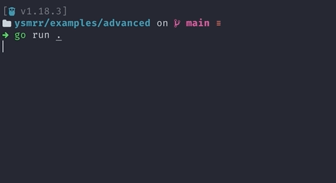

# You spin me right round

[](https://pkg.go.dev/github.com/chelnak/ysmrr) [](https://github.com/chelnak/ysmrr) [](https://goreportcard.com/report/github.com/chelnak/ysmrr)

You Spin Me Right Round (`ysmrr`) is a package that provides simple multi-line compatible spinners for Go applications.



## Installing

```bash
go get -u github.com/chelnak/ysmrr
```

## Usage

### SpinnerManager

A `SpinnerManager` is a collection of spinners that share a common configuration.

They can be created as follows:

```go
sm := ysmrr.NewSpinnerManager()
```

The `NewSpinnerManager` method also accepts multiple options. For example, you can change the animation and the color of the spinner:

```go
sm := ysmrr.NewSpinnerManager(
    ysmrr.WithAnimation(animations.Pipe),
    ysmrr.WithSpinnerColor(colors.FgHiBlue),
)
```

A `SpinnerManager` is also responsible for starting and stopping a group of spinners.

#### Starting a spinner group

```go
sm.Start()
```

#### Stopping a spinner group

```go
sm.Stop()
```

Running `Stop()` on a stopped spinner group is a noop operation.

#### Checking if a spinner group is running

```go
sm := ysmrr.NewSpinnerManager()
sm.Start()
isRunning := sm.Running() // true
sm.Stop()
isRunning = sm.Running() // false
```

### Spinners

`SpinnerManagers` are great but pretty useless on their own. You need to add at least one spinner.

Adding a new spinner is as simple as using the `AddSpinner` method on a `SpinnerManager` instance.

It expects a string that will be displayed as the initial message of a spinner.

```go
spinner := sm.AddSpinner("Downloading...")
```

`AddSpinner` will return a spinner instance that you can use to control the spinner.

#### Updating the message

Thoughout the lifecycle of a spinner, you can update the message of the spinner.

```go
spinner.UpdateMessage("Downloading...")
```

#### Spinner state

A spinner can be set to either `Complete` or `Error` to indicate the current state of a task.

```go
spinner.Complete()
```

```go
spinner.Error()
```

### Example

To tie everything together, here is an example that shows how to build a
basic spinner app.

```go
// Create a new spinner manager
sm := ysmrr.NewSpinnerManager()

// Add a spinner
mySpinner := sm.AddSpinner("Spinny things...")

// Start the spinners that have been added to the group
sm.Start()

// Set the spinner to complete
time.Sleep(2 * time.Second)
mySpinner.Complete()

// Stop the spinners in the group
time.Sleep(2 * time.Second)
sm.Stop()
```

For more usage examples, check out the [examples](examples) directory.

## Inspiration

Ysmrr was inspired by the following projects:

- [github.com/briandowns/spinner](https://github.com/briandowns/spinner)
- [github.com/theckman/yacspin](https://github.com/theckman/yacspin)

It also uses [github.com/fatih/color](https://github.com/fatih/color) for the underlying color system
and [github.com/mattn/go-colorable](https://github.com/mattn/go-colorable) for Windows support.
